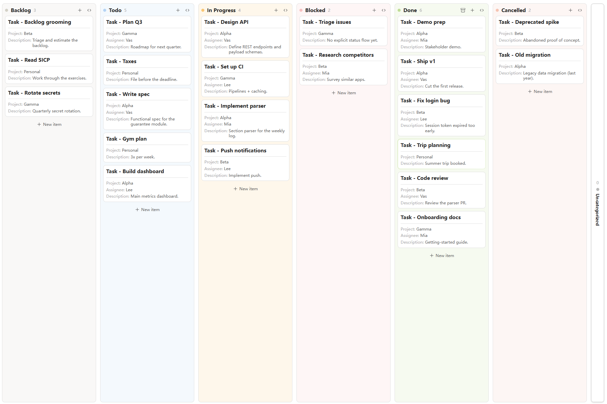
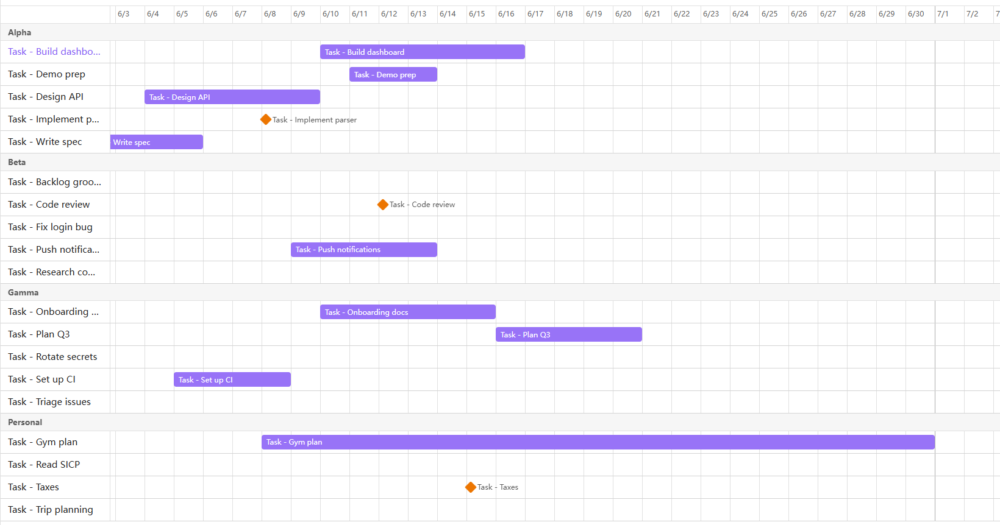
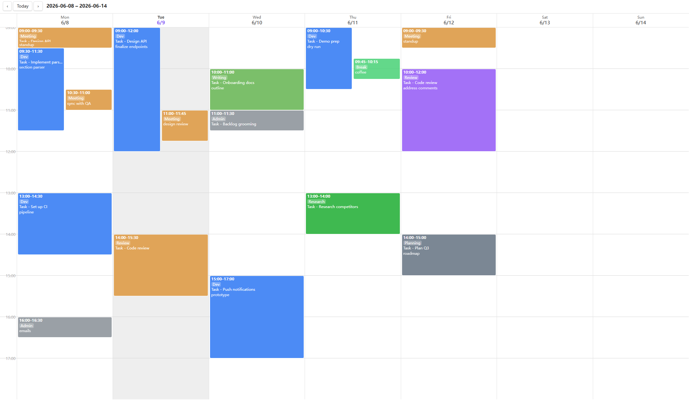
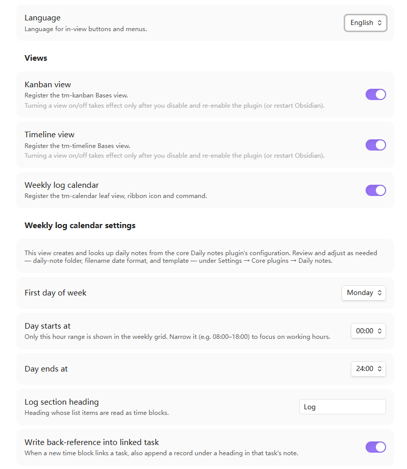

# Task Manager Bases View（任务管理 Bases 视图）

[English](./README.md) · [Deutsch](./README-de.md)

一个基于 **Obsidian [Bases](https://help.obsidian.md/bases)** 的轻量任务管理插件。它**只负责渲染**——任务数据存在你自己的 markdown frontmatter / 正文里，**所有分组与筛选都交给 Bases**。插件不拥有数据模型、不硬编码任何字段名。所有视图/类名统一以 `tm-` 前缀。

> 需要 **Obsidian 1.10.2+**（Bases 视图 API）。仅桌面端。

## 三个视图

| 视图 | 类型 | 作用 |
|------|------|------|
| **tm-kanban** | Bases 视图 | 列来自 Bases 分组（或预定义列），拖拽卡片改状态，右键移动/归档。 |
| **tm-timeline** | Bases 视图 | 由起止日期属性生成甘特条/里程碑，拖拽改期，支持泳道分组或平铺。 |
| **tm-calendar** | 独立视图 | 周时间网格，渲染日记里的日志时间块；拖拽新建、右键删除。 |

插件是一层薄渲染：改 frontmatter / 改 Bases 配置 / 拖拽 → Bases 重新查询 → 视图重渲染，从不长期持有查询结果。

## 功能

### 看板（`tm-kanban`）
- **分组完全走 Bases**：列来自 Bases 的**分组（group‑by）**，筛选与排序也都是 Bases 的。
- **预定义列**（视图选项）：按顺序列出列的值，每个可带颜色——`todo|#6b7280`、`doing|blue` 等；值与 Bases 分组键匹配；未匹配/空值归入折叠的 **未分组** 列。
- **完成列**：`doneStatuses` 指明哪些列值算“完成”，完成列会有一个**一键归档**按钮，一次归档该列全部卡片。
- **拖拽**卡片跨列改写其分组属性（仅可写的 `note.*`）。单击在右侧复用分栏打开笔记，mod+单击新建标签；拖拽不会误触发打开。
- **右键**卡片 → 移动到任意列，或**归档**（写入配置的归档值）。
- **记录变更日志**（视图选项，默认关闭）：开启后，移动卡片会在正文指定章节（**变更日志章节标题**，默认 `Changelog`）下追加一条 `- yyyy-MM-dd 旧->新` 列表项，章节不存在时自动创建——让每条笔记保留状态变更历史；状态未变化时不记录。
- Plane 风格列：整屏高、列头左侧标题+计数、右侧新增/折叠、可折叠为竖条、每列柔和底色、随流的“新建工作项”。



### 时间线（`tm-timeline`）
- 在视图选项里选择**开始/结束**日期属性；`scale` = 日 / 周 / 月。
- **泳道跟随 Bases 分组**（每组一条泳道），无分组时平铺。
- 起止齐全 → 条，仅一端 → **里程碑**点，无日期 → 仅标签。
- 每格竖向网格线，方便看出条跨了几格；时间窗口在数据两侧留出约 3 个月/周的余量，并自动滚动到今天。
- **拖拽**整条平移双端，拖端点改单端（回写到 `note.*`）。



### 周历日志日历（`tm-calendar`）
- 由**日记**构建的 7 天时间网格。唯一的正文约定是一个可配章节（默认 `Log`），其列表项即时间块：
  ```markdown
  ## Log
  - 14:00-15:00 (Dev) [[某任务]] 备注
  - 16:00-16:30
  ```
  格式：`HH:MM-HH:MM` → 可选 `(类型)` → 可选 `[[双链]]` → 可选备注。
- **重叠时间块**并排显示。在空白处**拖拽**（上下皆可）通过弹窗新建——弹窗里**起止时间可编辑**（用拖拽值预填，拖得不准可直接修正），另有描述 + 可选 `[[任务]]` 链接 + 类型。**右键**时间块删除。单击打开当天日记并定位到该行。
- **当前时间线**：在「今天」那一列横向绘制一条 now 线，每分钟刷新（本周不含今天、或当前时间不在可见时段内时隐藏）。
- **跳转到日期**：点击工具栏标题弹出日期选择器，跳转到任意一周（遵循每周起始日设置）。
- **类型/颜色**：可选，在设置中开启。以 `名称|颜色` 定义（颜色名、hex 或 `rgb(...)`），也可在行内联写 `(Dev|blue)`——与看板 `值|颜色` 同一套写法。
- **回写引用**（可选）：当时间块关联了任务时，在该任务笔记的指定章节追加一条带日期的记录。
- **自定义可见时段**（设置）：默认 `00:00–24:00`，可收窄（如 `09:00–18:00`）聚焦工作时段——网格会把可见小时拆分填满高度，时间块显示更大。



### 其它
- **点击任务 → 右侧分栏**：看板/时间线点击后在复用的详情分栏打开笔记（视图在左、笔记在右）。不另建详情视图——笔记本身即详情。
- **国际化**：英文 / 中文 / 德语，可在设置中切换（视图内文案实时刷新）。

## 安装

### 手动安装
1. 从 release 下载 `main.js`、`manifest.json`、`styles.css`（或按下文自行构建）。
2. 复制到 `<Vault>/.obsidian/plugins/task-manager-bases-view/`。
3. 重载 Obsidian，在 **设置 → 第三方插件** 启用。

### 从源码构建
```bash
npm install
npm run dev      # 监听构建 → main.js
npm run build    # svelte-check + 生产打包
```
产物 `main.js`（+ `manifest.json`、`styles.css`）位于项目根目录。

## 使用

1. 在任务笔记上建一个 Bases `.base` 文件。
2. 添加 **tm-kanban** 或 **tm-timeline** 视图，并从 Bases 工具栏配置：
   - 看板：设置**分组**（如 `status`）；可选开启**使用预定义列**并填写列值/颜色/完成状态/归档值。
   - 时间线：选择**开始/结束**日期属性和**刻度**。
3. 日历会把记录写入你的日记，因此需要启用核心**「日记」**插件（设置 → 核心插件 → 日记）。执行命令 **打开周历日志**（或点侧栏时钟图标）即可使用；如需关闭该视图，可在 **设置 → Task Manager Bases View** 里关掉。
4. 全局、跨文件的约定（每周起始、可见时段、日志章节、类型表、回写）在 **设置 → Task Manager Bases View** 里。日记的文件夹、文件名格式与模板取自核心**「日记」**插件（设置 → 核心插件 → 日记），本插件不再重复配置。

> 在设置里开关某个视图后，需要在「第三方插件」里**关闭再启用本插件**（或重启 Obsidian）才会生效——Bases 没有提供单视图注销 API。

每个视图可独立开关；日历的相关设置仅在其视图启用时才显示，保持设置页清爽：



## 视图选项速查

| 视图 | 选项 | 含义 |
|------|------|------|
| 看板 | `usePredefinedColumns` | 用有序、带色的预定义列，而非原始 Bases 分组。 |
| 看板 | `predefinedValues` | `值` 或 `值\|颜色` 行；与分组键匹配。 |
| 看板 | `doneStatuses` | 视为“完成”的列值（出现一键归档按钮）。 |
| 看板 | `archiveValue` | 右键归档 / 一键归档写入的值。 |
| 看板 | `recordChangelog` | 开启后，移动卡片把状态变更追加到正文章节。 |
| 看板 | `changelogSection` | 变更日志追加到的正文章节标题（默认 `Changelog`）。 |
| 时间线 | `startProp` / `endProp` | 条两端的日期属性。 |
| 时间线 | `scale` | `day` / `week` / `month`。 |

## 示例库

示例库是独立仓库 —— **[obsidian-task-manager-example-vault](https://github.com/vastea/obsidian-task-manager-example-vault)**，开箱即用，包含多项目数据集与多个 `.base`（按状态分组看板、预定义配色流水线、**通过筛选实现的分项目看板**、平铺/分组时间线、归档流程）以及供日历使用的日记。

## 开发说明

- **Svelte 5** + esbuild。入口 `src/main.ts` → 根 `main.js`（CJS 单文件）。
- `src/shared/` 是三视图共享内核（取值、frontmatter 回写、Value 渲染、章节解析、打开详情、色板、i18n）。
- 无遥测、无网络请求，全部本地运行。

## 反馈与问题

遇到 bug、不顺手的地方，或有新想法？**欢迎[提 issue](https://github.com/vastea/obsidian-task-manager-bases-view/issues)**——bug 反馈、功能建议、使用疑问都非常欢迎。附上截图和你的 Obsidian 版本会很有帮助。更新内容见[更新日志](./CHANGELOG.md)。

## 许可

[MIT](./LICENSE) © vastea
