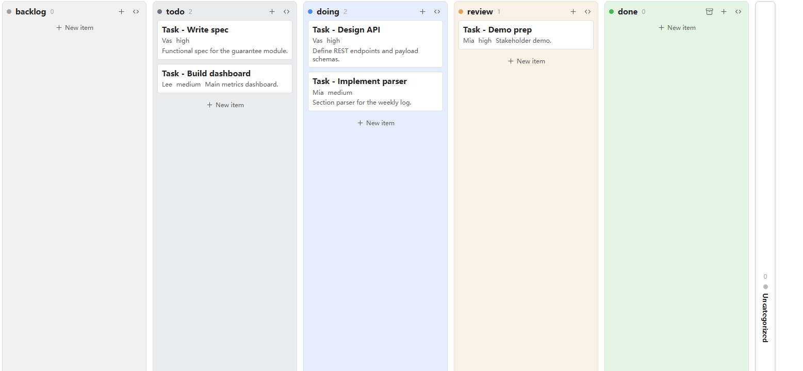
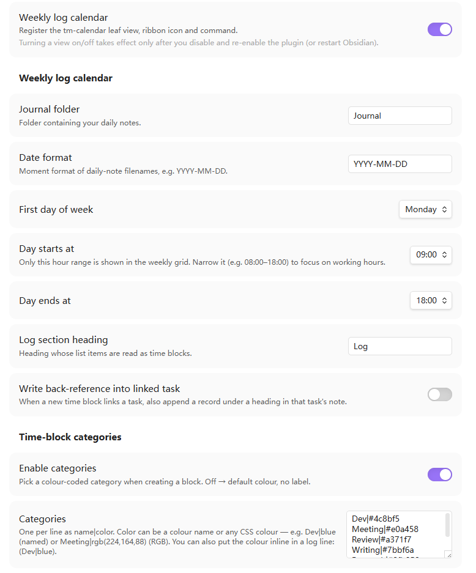

# Task Manager Bases View

[简体中文](./README-zh.md)

A lightweight task‑management plugin for **Obsidian [Bases](https://help.obsidian.md/bases)**. It only *renders* — your task data lives in your own markdown frontmatter / note body, and **all grouping and filtering is done by Bases**. The plugin owns no data model and hard‑codes no field names. Everything uses the `tm-` prefix.

> Requires **Obsidian 1.10+** (the Bases view API). Desktop only.

## Views

| View | Type | What it does |
|------|------|--------------|
| **tm-kanban** | Bases view | Columns from a Bases group‑by (or predefined columns), drag cards to change status, right‑click to move/archive. |
| **tm-timeline** | Bases view | Gantt‑style bars / milestones from start‑end date properties, drag to reschedule, grouped or flat lanes. |
| **tm-calendar** | Leaf view | Weekly time grid that renders daily‑note log blocks; drag to create, right‑click to delete. |

The plugin is a thin renderer: change frontmatter / Bases config / drag → Bases re‑queries → the view re‑renders. It never keeps a long‑lived reference to the query result.

## Features

### Kanban (`tm-kanban`)
- **Grouping is all Bases.** Columns come from the Bases **group‑by**. Filters and sort are Bases' too.
- **Predefined columns** (view option): list the column values in order, each with an optional colour — `todo|#6b7280`, `doing|blue`, … Values match the Bases group‑by keys; unmatched/empty groups fall into a collapsed **Uncategorized** column.
- **Done columns**: `doneStatuses` marks which column values count as done; that column gets an **Archive‑all** button to archive every card in one click.
- **Drag** a card between columns to rewrite its group property (only writable `note.*` properties). Click opens the note in a reused right split; mod‑click opens a new tab. Dragging never triggers a click‑open.
- **Right‑click** a card → move to any column, or **Archive** (writes the configured archive value).
- **Record changelog** (view option, off by default): when on, moving a card appends a `- yyyy-MM-dd old->new` list item under a configurable body section (**Changelog section heading**, default `Changelog`), creating the section if absent — so each note keeps a history of its status changes. Unchanged moves write nothing.
- Plane‑style columns: full height, header with title + count on the left and add / collapse on the right, columns collapse to a vertical bar, soft per‑column tint, in‑flow “new item” button.



### Timeline (`tm-timeline`)
- **Start / end** date properties chosen in view options; `scale` = day / week / month.
- **Lanes follow Bases group‑by** (one lane per group) or a flat list when ungrouped.
- Bars for start+end, **milestone** dots for a single end, label‑only for no dates.
- Vertical grid lines per cell so you can read how many cells a bar spans; a padded time window (≈3 months/weeks around the data) and auto‑scroll to today.
- **Drag** the bar to shift both dates, drag an edge to change one end (writeback to `note.*`).


### Weekly‑log calendar (`tm-calendar`)
- A 7‑day time grid built from your **daily notes**. The only body convention is one configurable section (default `Log`) whose list items are time blocks:
  ```markdown
  ## Log
  - 14:00-15:00 (Dev) [[Some task]] notes
  - 16:00-16:30
  ```
  Format: `HH:MM-HH:MM` → optional `(Category)` → optional `[[wikilink]]` → optional note.
- **Overlapping blocks** render side‑by‑side. **Drag** (up or down) on empty grid to create a block via a modal — its **start/end time is editable** (pre‑filled from the drag, so an imprecise drag can be corrected) alongside description + optional `[[task]]` link + category. **Right‑click** a block to delete it. Click opens that day's journal at the log line.
- **Current‑time indicator**: a now‑line is drawn across today's column, updating every minute (hidden when the week has no today or now is outside the day window).
- **Jump to date**: click the toolbar title to open a date picker and jump to any week (respects the week‑start setting).
- **Categories / colours**: optional, enabled in settings. Define `name|color` (a colour name, hex, or `rgb(...)`), or put the colour **inline** in the line — `(Dev|blue)` — exactly like the kanban `value|color` scheme.
- **Back‑reference** (optional): when a block links a task, append a dated record under a heading inside that task's note.
- **Custom day window** (settings): default `00:00–24:00`, but narrow it (e.g. `09:00–18:00`) to focus on working hours — the grid then splits the visible hours to fill the height, so blocks render larger.


### Other
- **Click a task → right split.** Kanban/timeline items open the note in a reused detail pane (view on the left, note on the right). No custom detail view — the note *is* the detail.
- **i18n**: English / 中文, switchable in settings (in‑view strings update live).

## Install

### Manual
1. Download `main.js`, `manifest.json`, `styles.css` from a release (or build them, below).
2. Copy them into `<Vault>/.obsidian/plugins/task-manager-bases-view/`.
3. Reload Obsidian and enable the plugin under **Settings → Community plugins**.

### Build from source
```bash
npm install
npm run dev      # watch build → main.js
npm run build    # svelte-check + production bundle
```
Outputs `main.js` (+ `manifest.json`, `styles.css`) in the project root.

## Usage

1. Create a Bases `.base` file over your task notes.
2. Add a **tm-kanban** or **tm-timeline** view; configure it from the Bases toolbar:
   - Kanban: set **Group by** (e.g. `status`); optionally enable **Use predefined columns** and fill the column values / colours / done statuses / archive value.
   - Timeline: pick the **start / end** date properties and a **scale**.
3. For the calendar, run the command **Open weekly log** (or the ribbon clock icon).
4. Global, cross‑file conventions (journal folder, date format, week start, day window, log section, categories, back‑reference) live in **Settings → Task Manager Bases View**.

> Toggling a view on/off in settings takes effect only after you disable and re‑enable the plugin (or restart Obsidian) — Bases has no per‑view unregister API.

Each view can be turned off independently, and the calendar's settings appear only while its view is enabled, keeping the page tidy:



## View options reference

| View | Option | Meaning |
|------|--------|---------|
| kanban | `usePredefinedColumns` | Use ordered, coloured predefined columns instead of raw Bases groups. |
| kanban | `predefinedValues` | `value` or `value\|color` lines; match the group‑by keys. |
| kanban | `doneStatuses` | Column values treated as “done” (gets the archive‑all action). |
| kanban | `archiveValue` | Value written by right‑click → Archive / Archive‑all. |
| timeline | `startProp` / `endProp` | Date properties for the bar ends. |
| timeline | `scale` | `day` / `week` / `month`. |

## Example vault

A separate, ready‑to‑open demo vault lives in its own repo — **[obsidian-task-manager-example-vault](https://github.com/vastea/obsidian-task-manager-example-vault)** — with a multi‑project dataset and several `.base` files (group‑by board, predefined‑colour pipeline, **per‑project boards via filters**, flat/grouped timeline, archive workflow) plus journals for the calendar.

## Development notes

- **Svelte 5** + esbuild. Entry `src/main.ts` → root `main.js` (CJS, single file).
- `src/shared/` is the three‑view kernel (entry access, frontmatter write, value render, section parser, open‑detail, palette, i18n).
- No telemetry, no network requests; everything is local.

## Feedback & issues

Found a bug, hit a rough edge, or have an idea? **Please [open an issue](https://github.com/vastea/obsidian-task-manager-bases-view/issues)** — bug reports, feature requests, and questions are all very welcome. A screenshot and your Obsidian version help a lot. See the [changelog](./CHANGELOG.md) for what's new.

## License

[MIT](./LICENSE) © vastea
